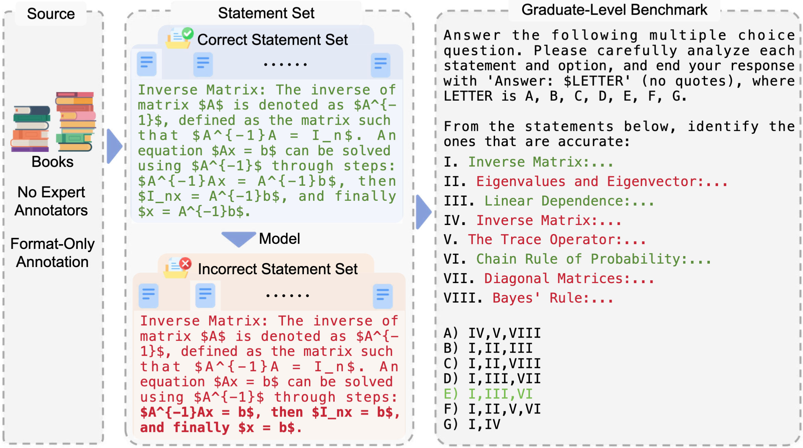
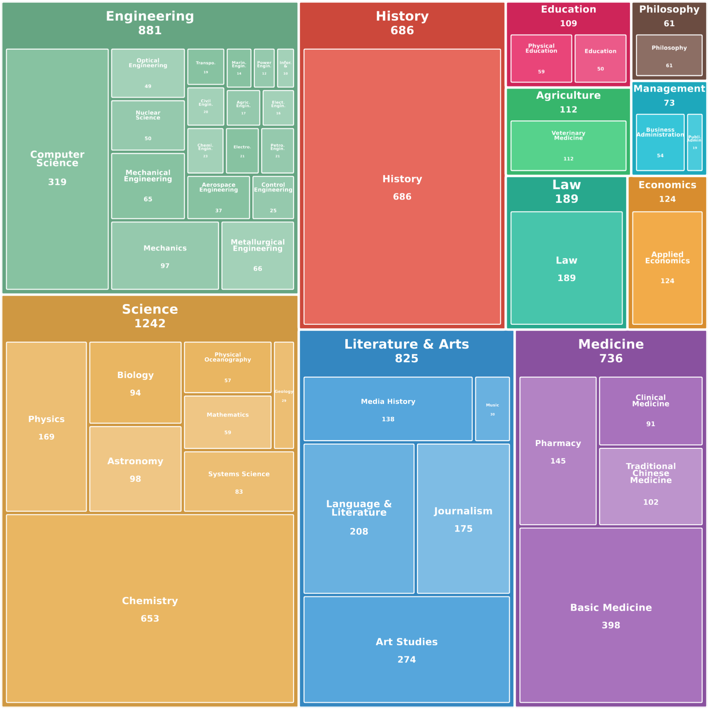
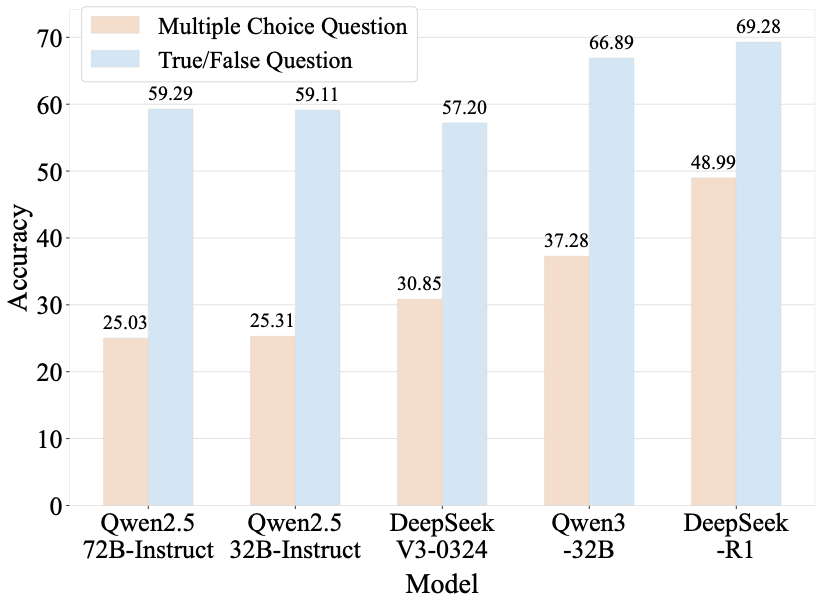
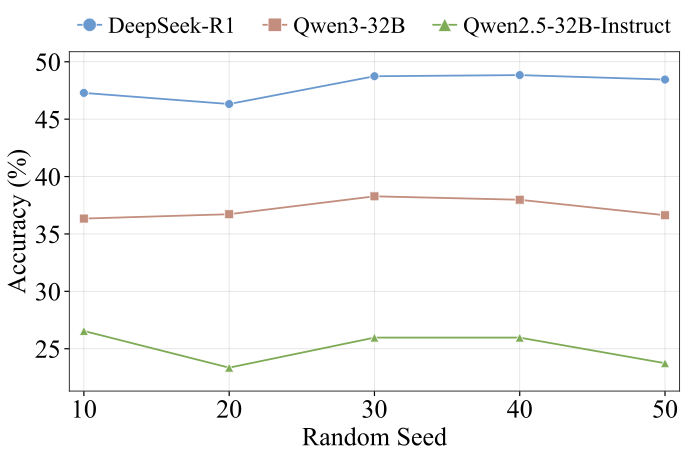

# _Encyclo-K_: Dynamic Evaluation of LLMs' Comprehensive Understanding over Multiple Knowledge Statements

<p align="center">
  🌐 <a href="https://encyclo-k.github.io/">Homepage</a> |
  🤗 <a href="https://huggingface.co/datasets/m-a-p/Encyclo-K">Dataset</a> |
  📖 <a href="https://arxiv.org/abs/2512.24867">ArXiv</a> |
  🏆 <a href="https://encyclo-k.github.io/#:~:text=isolated%20factual%20recall.-,Leaderboard,-We%20evaluate%2050">Leaderboard</a> |
  🐱 <a href="https://github.com/multimodal-art-projection/Encyclo-K">GitHub</a>
</p>

This repository contains the evaluation code for the paper "_Encyclo-K_: Dynamic Evaluation of LLMs' Comprehensive Understanding over Multiple Knowledge Statements".

---

## 🔔 Introduction
<p align="center">
  
</p>

**_Encyclo-K_** is a statement-based benchmark that rethinks benchmark construction from the ground up. Our key observation is that the question itself need not be the atomic unit of curation—individual knowledge statements can be.

### Key Features

- **Dynamic Evaluation**: We extract standalone knowledge statements from authoritative textbooks and dynamically compose them into evaluation questions through random sampling at test time. The combinatorial space is too vast to memorize, enabling reliable periodic dataset refresh.
- **Multi-Statement Comprehension**: Each question aggregates 8-10 statements for comprehensive multi-knowledge assessment, going beyond what single-statement questions can probe.
- **Cost-Effective Annotation**: Annotators only verify formatting compliance without requiring domain expertise, substantially reducing annotation costs.
- **Contamination Resistance**: Even if individual statements appear in training data, their compositions form a combinatorial space too vast to memorize.

### Question Distribution

The dataset comprises 5,038 questions across 11 disciplines, 44 fields, and 62 subfields. The disciplinary distribution is proportional to statement ratios: Science has the most questions (1,242, 24.7%), while Philosophy has the fewest (61, 1.2%). Each question contains 8–10 statements, 4–8 options, and 2–4 combinations.

<p align="center">
  
</p>

## ⚙️ Installation

To install the required packages, run:

```bash
# Clone the repository
git clone <repository-url>
cd Encyclo-K

# Install dependencies
pip install -r requirements.txt
```

## 🧠 Inference

You can directly perform inference on selected models using the following command:

```bash
export PYTHONPATH=$(pwd)

# Local model inference
python infer/infer.py --config <CONFIG_PATH> --split <TASKS> --mode zero-shot --model_name <MODEL_NAME> --output_dir <OUTPUT_DIR> --batch_size <BATCH_SIZE> --use_accel --index <INDEX> --world_size <WORLD_SIZE>

# API model inference
python infer/infer.py --config <CONFIG_PATH> --split <TASKS> --mode zero-shot --model_name <MODEL_NAME> --output_dir <OUTPUT_DIR> --num_worker <NUM_WORKERS> --index <INDEX> --world_size <WORLD_SIZE>
```

### Quick Start Examples

```bash
export PYTHONPATH=$(pwd)

# Local chat model with vLLM acceleration
python infer/infer.py --config config/config_default.yaml --split encyclo-k_all --mode zero-shot --model_name DeepSeek-V3-0324 --output_dir results/encyclo-k_all --batch_size 32 --use_accel --index 0 --world_size 1

# API reasoning model
python infer/infer.py --config config/config_reasoning_models.yaml --split encyclo-k_all --mode zero-shot --model_name DeepSeek-R1 --output_dir results/encyclo-k_all --num_worker 32 --index 0 --world_size 1
```

<!-- ### Parameter Explanations

| Parameter | Description |
|-----------|-------------|
| `--config` | Path to the configuration file |
| `--split` | Task categories for evaluation (e.g., `encyclo-k_all`) |
| `--mode` | Evaluation mode: `zero-shot` or `five-shot` |
| `--model_name` | Name of the model to use |
| `--output_dir` | Directory to save inference results |
| `--batch_size` | Batch size for local model inference |
| `--use_accel` | Enable vLLM acceleration for faster inference |
| `--num_worker` | Number of concurrent workers (for API calls) |
| `--index` | Index for data split (for distributed inference) |
| `--world_size` | Total number of workers (for distributed inference) | -->

### 📝 Notes

- If inference is unexpectedly interrupted, a temporary file `.jsonl.tmp` will be saved. You can directly rerun the command to resume from the last checkpoint.
- After inference is complete, check the `response` field in the saved JSONL file. If it contains an `error` field, you can rerun the command to re-infer failed samples.

### 🛠️ Run Custom Model

1. **`--model_name`**: This parameter must align with the filenames in the `infer/models` directory.
2. **Adding a Custom Model**: Update the configuration in `__init__.py` to include the new model

## ⭐ Evaluation

After completing inference, proceed with answer parsing and evaluation:

```bash
export PYTHONPATH=$(pwd)

# Evaluate results
python eval/eval.py --evaluate_all --excel_output --json_output --output_dir results/encyclo-k_all --save_dir results_with_status/encyclo-k_all --split encyclo-k_all
```

### Evaluation Parameters

| Parameter | Description |
|-----------|-------------|
| `--evaluate_all` | Evaluate all result files in the output directory |
| `--model_name` | Specific model(s) to evaluate |
| `--split` | Data split name |
| `--mode` | Evaluation modes (default: `zero-shot`, `five-shot`) |
| `--output_dir` | Directory containing inference results |
| `--save_dir` | Directory to save evaluation results with status |
| `--excel_output` | Generate Excel report with detailed results |
| `--json_output` | Generate JSON file with detailed results |

### Output Files

- **Excel Report**: Contains accuracy, error rate, and miss rate across disciplines, fields, and subfields
- **JSON Results**: Detailed results including per-category performance
- **JSONL with Status**: Original data augmented with `extracted_answer` and `status` fields

## 📊 Benchmark Characteristics

### Key Findings

<p align="center">
  
  
</p>
<!-- Performance comparison between single-statement judgment and multi-statement comprehensive understanding tasks. -->
<!-- Model accuracy across five dynamically generated question sets with different random seeds. -->

#### 1. Multi-Statement Comprehensive Assessment
Each question aggregates 8–10 knowledge statements, requiring models to jointly comprehend multiple knowledge points rather than isolated factual recall. This design introduces significant cognitive complexity beyond simple statement-level verification.

#### 2. Dynamic Question Generation
Encyclo-K supports dynamic question generation by varying random seeds that control statement selection and combination. Model rankings remain highly consistent across different question sets, confirming that the combinatorial design creates a vast question space resistant to memorization-based shortcuts. This enables periodic dataset refresh to prevent overfitting.


## 📈 Experimental Results

We evaluate 50+ LLMs on Encyclo-K. The benchmark poses substantial challenges with strong discriminative power:

| Model Type | Best Model | Accuracy | Range |
|:----------:|:----------:|:--------:|:-----:|
| Chat | Qwen3-235B-A22B-Instruct | 50.40% | 9.71% – 50.40% |
| Reasoning | OpenAI-GPT-5.1-high | 62.07% | 16.04% – 62.07% |

👉 **For complete leaderboard and more model results, please visit our [Homepage](https://encyclo-k.github.io/#:~:text=isolated%20factual%20recall.-,Leaderboard,-We%20evaluate%2050).**

## 🛠️ Dataset Maintenance
Despite multiple rounds of manual review, there may still be a small number of errors in the dataset. If you find any, please paste the question_id and statement index to the [Issues](https://github.com/multimodal-art-projection/Encyclo-K/issues) page, and we will make the corresponding corrections. Our team is committed to long-term maintenance of this dataset to ensure its quality!

## 📚 Citation

If you find Encyclo-K useful in your research, please cite our paper:

```bibtex
@article{liang2025encyclo0k0,
  title   = {Encyclo-K: Evaluating LLMs with Dynamically Composed Knowledge Statements},
  author  = {Yiming Liang and Yizhi Li and Yantao Du and Ge Zhang and Jiayi Zhou and Yuchen Wu and Yinzhu Piao and Denghui Cao and Tong Sun and Ziniu Li and Li Du and Bo Lei and Jiaheng Liu and Chenghua Lin and Zhaoxiang Zhang and Wenhao Huang and Jiajun Zhang},
  year    = {2025},
  journal = {arXiv preprint arXiv: 2512.24867}
}
```


## 🤝 Acknowledgements

We thank the contributors and the open-source community for their valuable support. The evaluation pipeline of this project is built upon several excellent open-source benchmarks, including [MMLU](https://github.com/hendrycks/test), [MMLU-Pro](https://github.com/TIGER-AI-Lab/MMLU-Pro), [GPQA](https://github.com/idavidrein/gpqa), and [SuperGPQA](https://github.com/SuperGPQA/SuperGPQA).


## 📜 License

This project is licensed under the terms specified in the [LICENSE](LICENSE) file.
